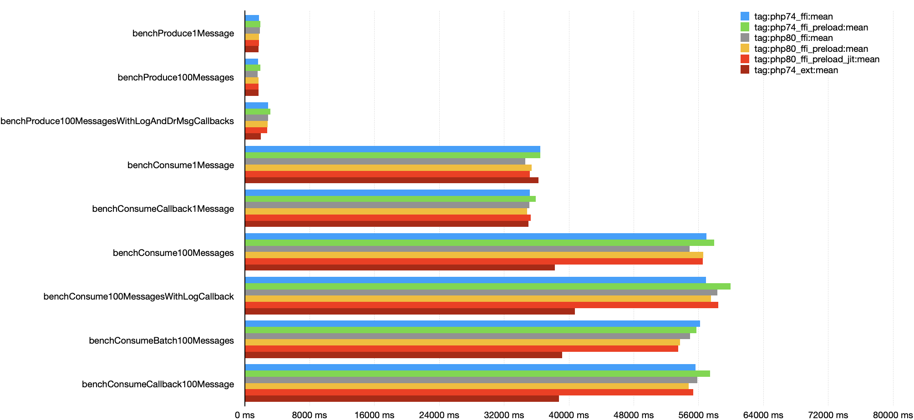
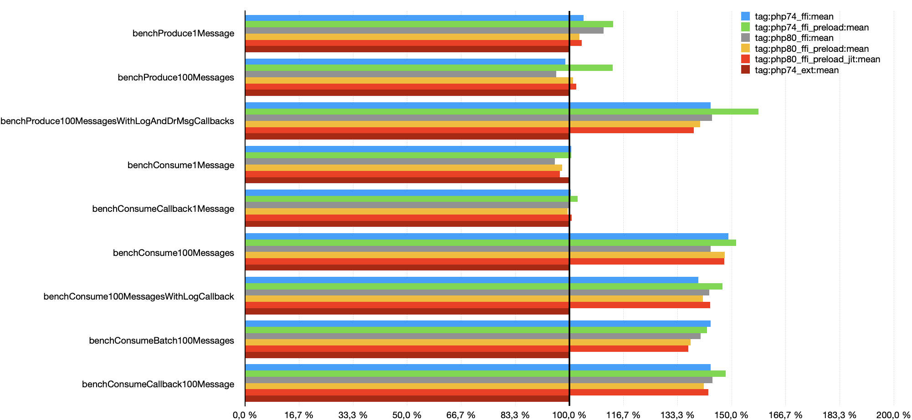
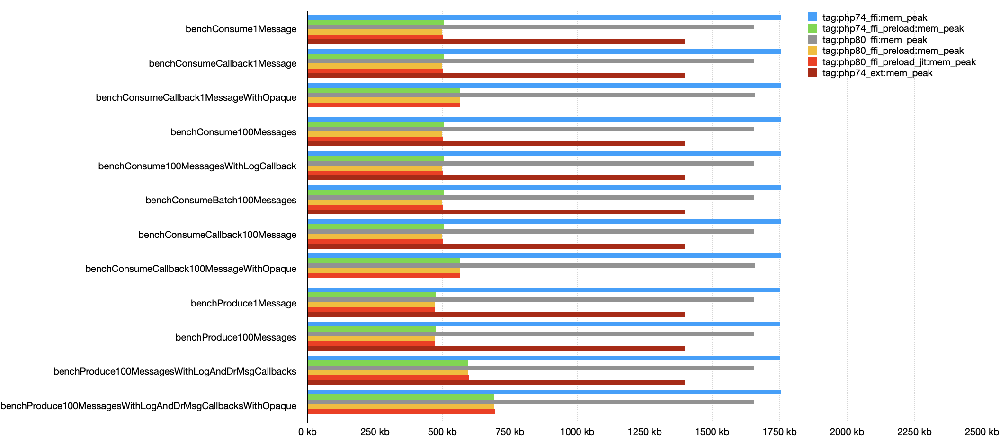
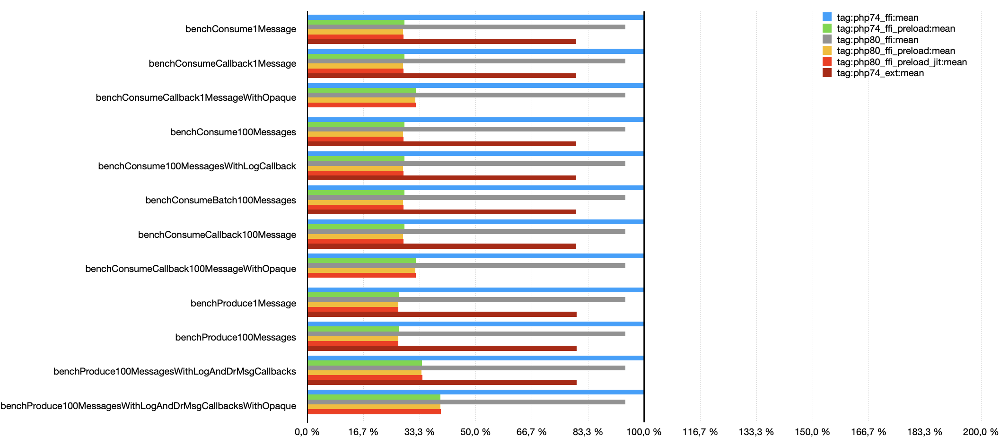

# Benchmarks

These benchmarks were run with version 0.1.0.

!!! Note
    Please note that these benchmarks depend on asynchronous responses/requests to a Kafka broker.

## Variants

All variants use librdkafka v1.5.2.

| Tag                   | PHP                                    | PHP Config                | phpbench Config      |
|-----------------------|----------------------------------------|---------------------------|----------------------|
| php74_ffi             | 7.4.13                                 | opcache                   | ffi.json             |
| php74_ffi_preload     | 7.4.13                                 | opcache preload        | ffi_preload.json     |
| php80_ffi             | 8.0.0                                  | opcache                   | ffi.json             |
| php80_ffi_preload     | 8.0.0                                  | opcache preload        | ffi_preload.json     |
| php80_ffi_preload_jit | 8.0.0                                  | opcache preload jit | ffi_preload_jit.json |
| php74_ext             | 7.4.13 RdKafka Extension v4.0.5-dev | opcache                   | ext.json             |

## Runtime Mean FFI <> Extension

## Memory Peak FFI <> Extension

## Raw reports & env data

See https://github.com/idealo/php-rdkafka-ffi/tree/main/benchmarks/reports

## Setup

* Hetzner CCX21 Cloud Server (dedicated 4 vCPU, 16 GB Ram, NVMe SSD)
* Ubuntu 20.04
* docker ce 19.03.14
* docker-compose with images for php 7.4 / 8.0 and librdkafka 1.5.2 installed
    * see https://github.com/idealo/php-rdkafka-ffi/blob/main/docker-compose.yml
    * see https://github.com/idealo/php-rdkafka-ffi/tree/main/resources/docker

## Run benchmarks

See [running benchmarks in try out](try-out.md/#run-benchmarks).

There are [ansible playbooks in resources](https://github.com/idealo/php-rdkafka-ffi/tree/main/resources/benchmarks) to setup and run benchmarks.